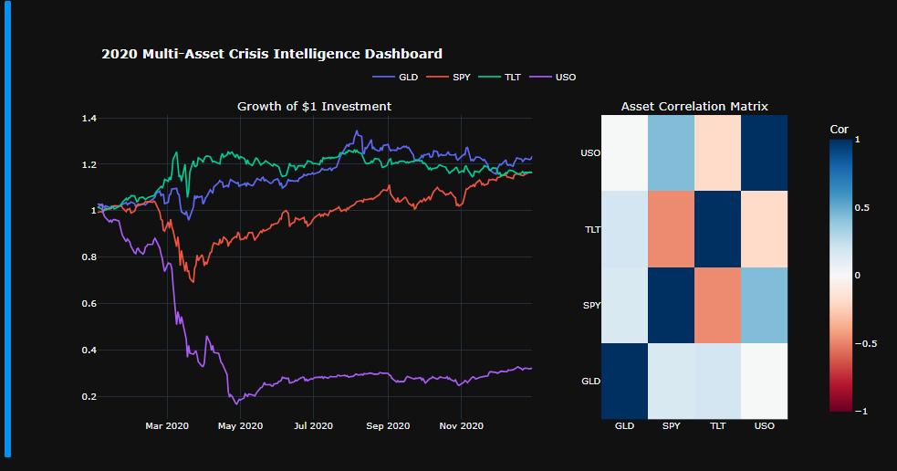

# Multi-Asset Regime Analysis: The 2020 Liquidity Shock
> **A quantitative study of asset decoupling and risk-adjusted performance during systemic market stress.**

## 📌 Project Overview
This project engineers a quantitative risk-assessment pipeline to evaluate how different asset classes—Equities (SPY), Bonds (TLT), Gold (GLD), and Commodities (USO)— behaved during the high-volatility regime of 2020. 

## 📊 2020 Multi-Asset Crisis Intelligence Dashboard

*Interactive version available in the Jupyter Notebook.*

## 🛠️ Technical Stack
* **Language:** Python 3.10+
* **Data Engineering:** Pandas, NumPy, yfinance
* **Quantitative Metrics:** Sharpe Ratio, Sortino Ratio, Modigliani-Modigliani (M2) Ratio
* **Visualization:** Plotly (Interactive Dashboards)
* **Mathematical Notation:** LaTeX

## 📊 Key Findings
* **Regime Decoupling:** Quantified a significant correlation breakdown, specifically a **-0.48 correlation** between SPY and TLT, validating the "Flight to Safety" hypothesis.
* **Risk-Adjusted Efficiency:** Calculated an **M2 Ratio of 16.45%**, providing a standardized view of portfolio performance relative to the benchmark.
* **Downside Protection:** Utilized the Sortino Ratio to isolate downside volatility, revealing Gold's unique role as a non-correlated store of value during the liquidity crash.

## 🚀 How to Run
1. Clone the repo: `git clone https://github.com/WyattEarls/Computational-Finance-Spring-2026.git`
2. Install dependencies: `pip install pandas numpy yfinance plotly`
3. Open `Multi_Asset_Analysis.ipynb` in Jupyter Notebook or VS Code.
